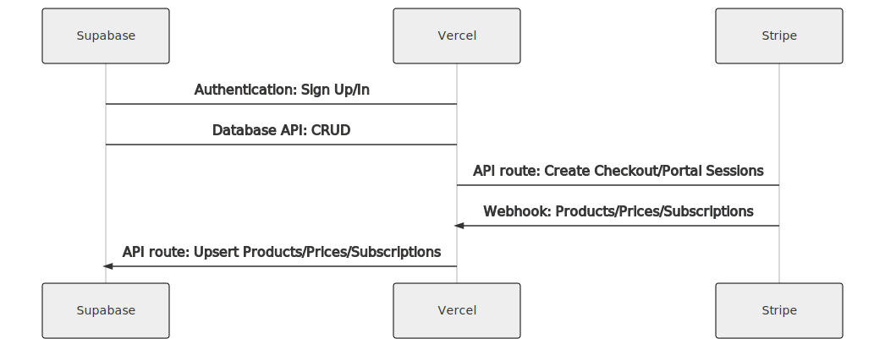

# Next.js Subscription Payments Starter

The all-in-one starter kit for high-performance SaaS applications.

## Features

- Secure user management and authentication with [Supabase](https://supabase.io/docs/guides/auth).
- Powerful data access & management tooling on top of PostgreSQL with [Supabase](https://supabase.io/docs/guides/database).
- Integration with [Stripe Checkout](https://stripe.com/docs/payments/checkout) and the [Stripe customer portal](https://stripe.com/docs/billing/subscriptions/customer-portal), all plumbing already set up.
- Automatic syncing of pricing plans, and subscription statuses via [Stripe webhooks](https://stripe.com/docs/webhooks).

## Demo

- https://subscription-payments.vercel.app/

[](https://subscription-payments.vercel.app/)

## Architecture



## Deploy with Vercel

The Vercel deployment will guide you through creating a Supabase account and project as well as a Stripe test account and automatically creates the Stripe webhook endpoint for you. After installation of the Supabase and Stripe integrations, all relevant environment variables will be set up so that the project is usable immediately after deployment.

**Note:** The Stripe integration is still a work-in-progress.

[](https://vercel.com/new/git/external?repository-url=https%3A%2F%2Fgithub.com%2Fvercel%2Fnextjs-subscription-payments&project-name=nextjs-subscription-payments&repo-name=nextjs-subscription-payments&demo-title=Next.js%20Subscription%20Payments%20Starter&demo-description=Demo%20project%20on%20Vercel&demo-url=https%3A%2F%2Fsubscription-payments.vercel.app&demo-image=https%3A%2F%2Fsubscription-payments.vercel.app%2Fdemo.png&integration-ids=oac_pb1dqJT8Ry2D99Q0o9qXWIhJ,oac_jUduyjQgOyzev1fjrW83NYOv&external-id=nextjs-subscription-payments)

[](https://vercel.com/new/git/external?repository-url=https%3A%2F%2Fgithub.com%2Fvercel%2Fnextjs-subscription-payments&project-name=nextjs-subscription-payments&repo-name=nextjs-subscription-payments&demo-title=Next.js%20Subscription%20Payments%20Starter&demo-description=Demo%20project%20on%20Vercel&demo-url=https%3A%2F%2Fsubscription-payments.vercel.app&demo-image=https%3A%2F%2Fsubscription-payments.vercel.app%2Fdemo.png&integration-ids=oac_pb1dqJT8Ry2D99Q0o9qXWIhJ,oac_jUduyjQgOyzev1fjrW83NYOv&external-id=nextjs-subscription-payments)

Once the project has been deployed, continue with the configuration steps below.

## Configure Supabase Auth

#### [Optional] - Set up OAuth providers

You can use third-party login providers like GitHub or Google. Refer to the [docs](https://supabase.io/docs/guides/auth#third-party-logins) to learn how to configure these.

## Configure Stripe

### Create product and pricing information

For Stripe to automatically bill your users for recurring payments, you need to create your product and pricing information in the [Stripe Dashboard](https://dashboard.stripe.com/test/products). When you create or update your product and price information, the changes are automatically synced with your Supabase database.

Stripe Checkout currently supports pricing plans that bill a predefined amount at a specific interval. More complex plans (e.g. different pricing tiers or seats) are not yet supported.

For example, you can create business models with different pricing tiers, e.g.:

- Product 1: Hobby
  - Price 1: 10 USD per month
  - Price 2: 100 USD per year
- Product 2: Freelancer
  - Price 1: 20 USD per month
  - Price 2: 200 USD per year

### Configure the Stripe customer portal

1. Set your custom branding in the [settings](https://dashboard.stripe.com/settings/branding).
1. Configure the Customer Portal [settings](https://dashboard.stripe.com/test/settings/billing/portal).
1. Toggle on "Allow customers to update their payment methods".
1. Toggle on "Allow customers to update subscriptions".
1. Toggle on "Allow customers to cancel subscriptions".
1. Add the products and prices that you want to allow customer to switch between.
1. Set up the required business information and links.

### That's it

That's it, you're now ready to earn recurring revenue from your customers 🥳

## Going live

Before going live, make sure you archive all your test mode Stripe products, so you don't end up having a mix of test and live mode products on your page. Before creating your live mode products, make sure to follow the steps below to set up your live mode env vars and webhooks.

To run the project in live mode and process real payments with Stripe, you can add the [Stripe Go Live](https://vercel.com/integrations/stripe-live) integration to your project. This will set up your live API keys and webhook secret as environment variables for the production environment.

Afterward you will need to rebuild your production deployment for the changes to take effect. Within your project Dashboard, navigate to the "Deployments" tab, select the most recent deployment, click the overflow menu button (next to the "Visit" button) and select "Redeploy".

## Develop locally

Deploying with Vercel will have created a repository for you which you can clone to your local machine.

Next, use the [Vercel CLI](https://vercel.com/download) to link your project:

```bash
vercel login
vercel link
```

### Setting up the env vars locally

Use the Vercel CLI to download the development env vars:

```bash
vercel env pull .env.local
```

This will create a new `.env.local` file in your project folder. For security purposes you will need to set the `SUPABASE_SERVICE_ROLE_KEY` manually from your [Supabase dashboard](https://app.supabase.io/) (Settings > API). Lastly, the webhook secret differs for local testing vs. when deployed to Vercel. Follow the instructions below to get the corresponding webhook secret.

### Use the Stripe CLI to test webhooks

First [install the CLI](https://stripe.com/docs/stripe-cli) and [link your Stripe account](https://stripe.com/docs/stripe-cli#login-account).

Next, start the webhook forwarding:

```bash
stripe listen --forward-to=localhost:3000/api/webhooks
```

The CLI will print a webhook secret (such as, `whsec_***`) to the console. Set `STRIPE_WEBHOOK_SECRET` to this value in your `.env.local` file.

### Install dependencies and run the Next.js client

```bash
npm install
npm run dev
# or
yarn
yarn dev
```
